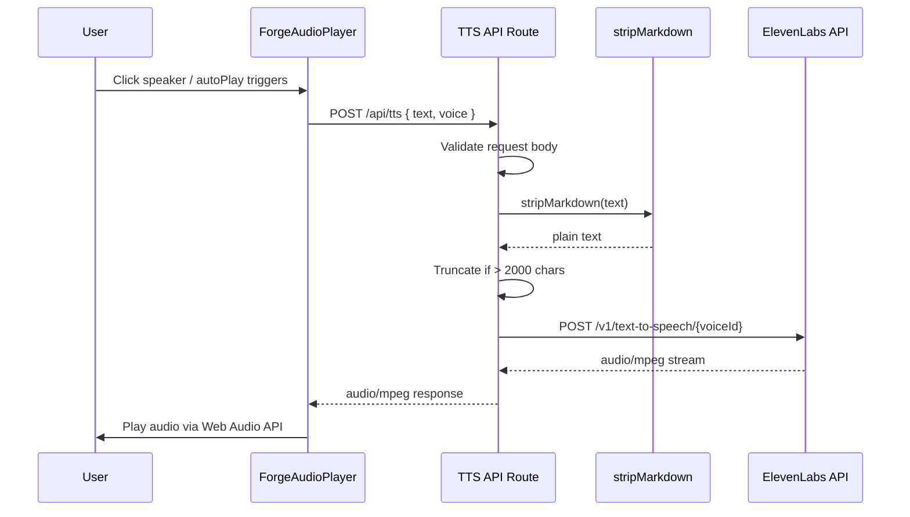
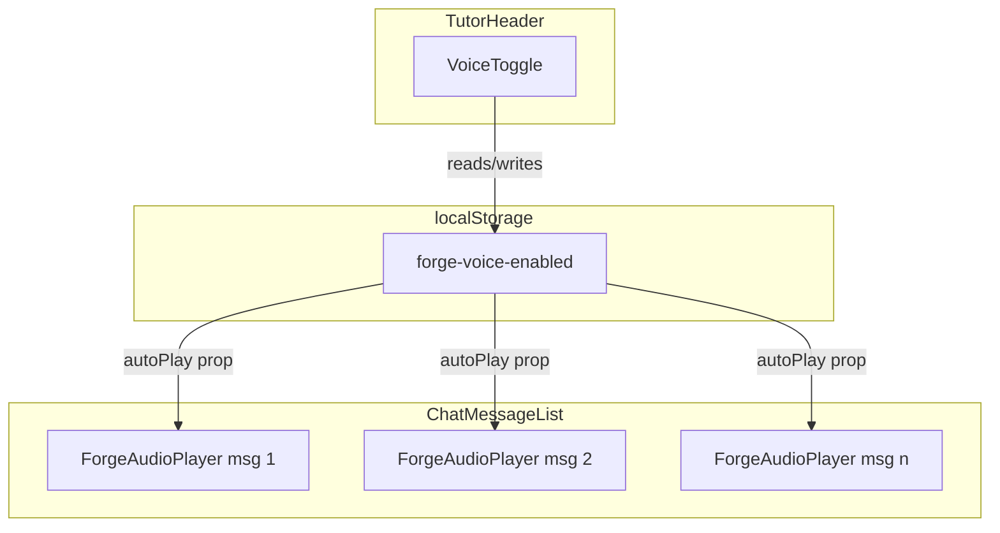

# Design Document: ElevenLabs Voice (TTS)

## Overview

This design adds text-to-speech capability to ForgeNursing by integrating the ElevenLabs streaming TTS API. The feature is entirely additive — no existing files are modified in ways that change behavior. The system consists of four new artifacts:

1. A server-side API route (`/api/tts`) that proxies requests to ElevenLabs, keeping the API key secret
2. A markdown-stripping utility (`stripMarkdown`) that cleans Forge responses into natural spoken text
3. A `ForgeAudioPlayer` React component that fetches and plays audio per message
4. A `VoiceToggle` button in the TutorHeader that controls auto-play via localStorage

The processing pipeline in the API route is: **receive raw text → strip markdown → enforce 2000-char limit → call ElevenLabs → stream audio back**.

## Architecture





### Design Decisions

- **Server-side proxy over client-side calls**: The ElevenLabs API key must never reach the browser. A Next.js API route is the simplest proxy that also lets us strip markdown and truncate server-side, reducing client complexity.
- **Streaming passthrough**: The TTS route streams the ElevenLabs response directly back to the client rather than buffering the entire audio file. This reduces time-to-first-byte and memory usage on Vercel.
- **localStorage for voice preference**: No database schema changes needed. The preference is purely cosmetic and per-device, making localStorage the right fit.
- **Separate `stripMarkdown` utility vs. reusing `cleanChatTitle`**: The existing `cleanChatTitle` in `src/lib/utils.ts` truncates to 50 chars and is tuned for dashboard titles. The TTS stripper needs to handle full message bodies without truncation, so a dedicated function in `src/lib/tts-utils.ts` is cleaner.

## Components and Interfaces

### 1. TTS API Route — `src/app/api/tts/route.ts`

```typescript
// Exported config
export const maxDuration = 30;

// Voice ID mapping
const VOICE_MAP: Record<string, string> = {
  forge: 'pNInz6obpgDQGcFmaJgB',   // Adam
  patient: 'EXAVITQu4vr4xnSDxMaL', // Bella
};

// Request body schema
interface TTSRequestBody {
  text: string;
  voice: 'forge' | 'patient';
}

// POST handler
export async function POST(req: NextRequest): Promise<NextResponse>;
```

Responsibilities:
- Validate `text` (non-empty string) and `voice` (one of `'forge' | 'patient'`)
- Check `ELEVENLABS_API_KEY` env var exists
- Call `stripMarkdown(text)` then `truncateForTTS(strippedText, 2000)`
- POST to `https://api.elevenlabs.io/v1/text-to-speech/{voiceId}` with model `eleven_monolingual_v1`
- Stream the response body back with `Content-Type: audio/mpeg`

### 2. Markdown Stripper — `src/lib/tts-utils.ts`

```typescript
/**
 * Strips markdown formatting from text for natural TTS output.
 * Removes: headings, bold, italic, bullet points, numbered lists,
 * inline code, code blocks, links, blockquotes, horizontal rules.
 * Preserves underlying plain text content.
 */
export function stripMarkdown(text: string): string;

/**
 * Truncates text to maxLength chars, appending '...' if truncated.
 * Applied AFTER markdown stripping per Requirement 2.4.
 */
export function truncateForTTS(text: string, maxLength?: number): string;
```

The `stripMarkdown` function applies regex replacements in order:
1. Remove code blocks (``` ... ```)
2. Remove inline code (`` ` ``)
3. Remove headings (`# `, `## `, `### `, etc.)
4. Remove bold (`**text**`, `__text__`)
5. Remove italic (`*text*`, `_text_`)
6. Remove links (`[text](url)` → `text`)
7. Remove images (``)
8. Remove blockquotes (`> `)
9. Remove bullet/list markers (`- `, `* `, `+ `, `1. `)
10. Remove horizontal rules (`---`, `***`)
11. Collapse multiple newlines and trim whitespace

### 3. ForgeAudioPlayer — `src/components/forge-audio-player.tsx`

```typescript
interface ForgeAudioPlayerProps {
  text: string;
  autoPlay: boolean;
}

type PlayerState = 'idle' | 'loading' | 'playing' | 'error';
```

State machine:
- **idle** → user clicks or autoPlay triggers → **loading**
- **loading** → audio fetched and decoded → **playing**
- **loading** → fetch/decode fails → **error**
- **playing** → user clicks stop or audio ends → **idle**
- **error** → user clicks retry → **loading**

Visual states:
| State     | Icon                  | Background        |
|-----------|-----------------------|-------------------|
| idle      | `Volume2` (teal)      | transparent       |
| loading   | `Volume2` (pulsing)   | transparent       |
| playing   | `Volume2` (animated)  | `#E0F4F6`         |
| error     | `VolumeX` (gray)      | transparent       |

The component uses `useRef` for an `AudioContext` and `AudioBufferSourceNode` to play decoded audio. Cleanup on unmount stops any active playback and closes the AudioContext.

### 4. VoiceToggle — `src/components/tutor/VoiceToggle.tsx`

```typescript
interface VoiceToggleProps {
  enabled: boolean;
  onToggle: (enabled: boolean) => void;
}
```

A small icon button using `Volume2` (enabled) or `VolumeX` (disabled) from `lucide-react`. On click, it calls `onToggle(!enabled)`. The parent component (`TutorSession` or `ChatInterface`) owns the state and persists to localStorage.

### 5. Integration Points

- **ChatMessageList**: For each assistant message, render `<ForgeAudioPlayer text={m.content} autoPlay={voiceEnabled} />` at the bottom-right of the message card, inside the existing `<article>` element.
- **TutorHeader**: Add `<VoiceToggle>` next to the Forge identity section (left side of header, after the name/subtitle).
- **State management**: The `voiceEnabled` boolean lives in the component that owns both the header and the message list (likely `TutorSession` or `ChatInterface`). It reads from `localStorage('forge-voice-enabled')` on mount and writes on toggle.

## Data Models

### Request/Response Schemas

**TTS API Request (POST /api/tts)**:
```json
{
  "text": "string (required, non-empty)",
  "voice": "'forge' | 'patient' (required)"
}
```

**TTS API Success Response**:
- Status: `200`
- Content-Type: `audio/mpeg`
- Body: binary audio stream

**TTS API Error Responses**:
```json
// 400 - Bad Request
{ "error": "Text is required" }
{ "error": "Voice must be 'forge' or 'patient'" }

// 500 - Server Error
{ "error": "TTS service not configured" }

// 502 - Bad Gateway
{ "error": "TTS service returned an error" }
```

### ElevenLabs API Call

```
POST https://api.elevenlabs.io/v1/text-to-speech/{voiceId}
Headers:
  xi-api-key: {ELEVENLABS_API_KEY}
  Content-Type: application/json
Body:
  {
    "text": "<stripped and truncated text>",
    "model_id": "eleven_monolingual_v1",
    "voice_settings": {
      "stability": 0.5,
      "similarity_boost": 0.75
    }
  }
```

### localStorage Schema

| Key                    | Type    | Default | Description                        |
|------------------------|---------|---------|------------------------------------|
| `forge-voice-enabled`  | string  | `"false"` | `"true"` or `"false"` — auto-play preference |


## Correctness Properties

*A property is a characteristic or behavior that should hold true across all valid executions of a system — essentially, a formal statement about what the system should do. Properties serve as the bridge between human-readable specifications and machine-verifiable correctness guarantees.*

### Property 1: Invalid requests are rejected with 400

*For any* request body where `text` is missing, empty, or whitespace-only, OR where `voice` is missing or not one of `'forge'` or `'patient'`, the TTS API route validation function shall return a 400-level error with a descriptive message.

**Validates: Requirements 1.7, 1.8**

### Property 2: Markdown stripping removes markers and preserves content

*For any* plain text string, wrapping it in arbitrary markdown formatting (bold, headings, italic, bullet points, code blocks, links) and then applying `stripMarkdown` shall produce a result that contains all the original words and contains none of the markdown syntax characters (`**`, `##`, `- ` at line start, etc.).

**Validates: Requirements 2.1, 2.2**

### Property 3: Markdown stripping is idempotent

*For any* string `s`, `stripMarkdown(stripMarkdown(s))` shall be identical to `stripMarkdown(s)`.

**Validates: Requirements 2.3**

### Property 4: Processed text never exceeds 2000 characters

*For any* input string (of any length, with or without markdown), after applying `stripMarkdown` then `truncateForTTS`, the resulting string shall have length ≤ 2000. Furthermore, if the stripped text was already ≤ 2000 characters, the result shall equal the stripped text exactly (no modification). If the stripped text exceeded 2000 characters, the result shall be exactly 2000 characters and end with `...`.

**Validates: Requirements 2.4, 3.1, 3.2, 3.3**

### Property 5: Each assistant message gets a ForgeAudioPlayer with matching text

*For any* list of chat messages, the number of rendered `ForgeAudioPlayer` components shall equal the number of messages with `role === 'assistant'`, and each player's `text` prop shall equal the corresponding assistant message's `content`.

**Validates: Requirements 5.1, 5.3**

### Property 6: Voice preference toggle consistency

*For any* boolean state of `voiceEnabled`, clicking the VoiceToggle shall produce the negated state, and the `autoPlay` prop passed to all ForgeAudioPlayer instances shall equal the current `voiceEnabled` value.

**Validates: Requirements 6.2, 6.3, 6.4**

### Property 7: Voice preference localStorage round-trip

*For any* boolean preference value, writing it to localStorage under `forge-voice-enabled` and then reading it back shall produce the same boolean value.

**Validates: Requirements 6.5, 6.7**

## Error Handling

| Scenario | Handler | Response |
|----------|---------|----------|
| Missing or empty `text` | TTS API route validation | 400 `{ error: "Text is required" }` |
| Invalid `voice` value | TTS API route validation | 400 `{ error: "Voice must be 'forge' or 'patient'" }` |
| `ELEVENLABS_API_KEY` not set | TTS API route env check | 500 `{ error: "TTS service not configured" }` |
| ElevenLabs API returns non-2xx | TTS API route fetch check | 502 `{ error: "TTS service returned an error" }` |
| ElevenLabs API network timeout | TTS API route fetch catch | 502 `{ error: "TTS service returned an error" }` |
| Audio fetch fails in browser | ForgeAudioPlayer catch | Transition to `error` state, show `VolumeX` icon |
| AudioContext decode fails | ForgeAudioPlayer catch | Transition to `error` state, show `VolumeX` icon |
| localStorage unavailable | VoiceToggle try/catch | Default to `false` (voice disabled), fail silently |

All errors are handled locally — no error propagates to crash the page or disrupt existing functionality. The ForgeAudioPlayer degrades gracefully to a muted icon on failure, and the user can retry by clicking again.

## Testing Strategy

### Test Runner & Libraries

The project currently has no unit test runner. The testing strategy requires adding:

- **vitest** — fast, TypeScript-native test runner compatible with the Next.js/Vite ecosystem
- **fast-check** — property-based testing library for TypeScript
- **@testing-library/react** + **@testing-library/jest-dom** — for component rendering tests

Install: `npm install -D vitest fast-check @testing-library/react @testing-library/jest-dom @vitejs/plugin-react jsdom`

### Dual Testing Approach

**Unit tests** cover specific examples, edge cases, and integration points:
- Voice ID mapping returns correct IDs for `'forge'` and `'patient'`
- `maxDuration` export equals `30`
- Model ID is `eleven_monolingual_v1`
- Response content type is `audio/mpeg`
- Missing API key returns 500
- Upstream ElevenLabs error returns 502
- ForgeAudioPlayer renders a button in idle state
- ForgeAudioPlayer transitions to error state on fetch failure
- ForgeAudioPlayer auto-plays when `autoPlay` is true
- VoiceToggle defaults to disabled when no localStorage value exists

**Property-based tests** verify universal properties across randomized inputs:
- Each correctness property (1–7) maps to exactly one `fast-check` property test
- Minimum 100 iterations per property test
- Each test is tagged with a comment: `Feature: elevenlabs-voice, Property {N}: {title}`

### Test File Structure

```
__tests__/
  tts-utils.test.ts        # Properties 2, 3, 4 (stripMarkdown, truncateForTTS)
  tts-route.test.ts         # Property 1 (input validation)
  forge-audio-player.test.tsx  # Property 5, unit tests for component states
  voice-toggle.test.tsx     # Properties 6, 7, unit tests for toggle behavior
```

### Property Test Configuration

Each property test must:
1. Use `fc.assert(fc.property(...))` from `fast-check`
2. Run at least 100 iterations (default in fast-check is 100, which satisfies this)
3. Include a comment tag: `// Feature: elevenlabs-voice, Property {N}: {title}`
4. Reference the design document property it validates

The pure utility functions (`stripMarkdown`, `truncateForTTS`) are the primary targets for property-based testing since they are stateless and easy to generate inputs for. Component properties (5, 6, 7) will use a combination of property-based generation for input data and React Testing Library for rendering verification.
